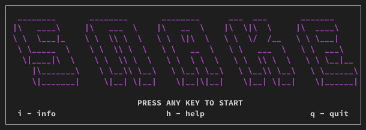
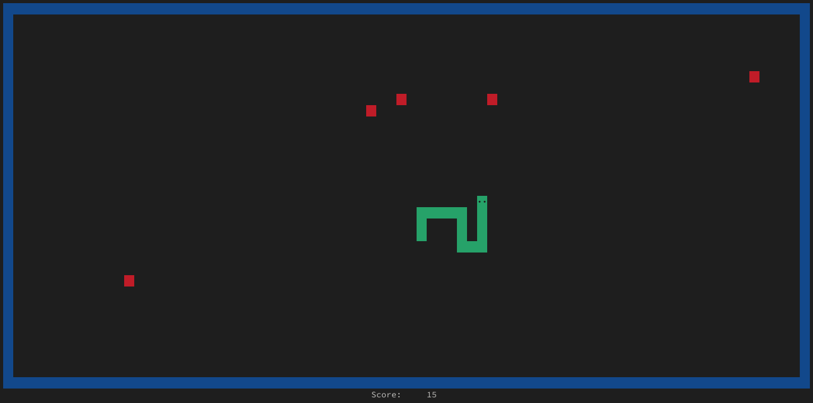
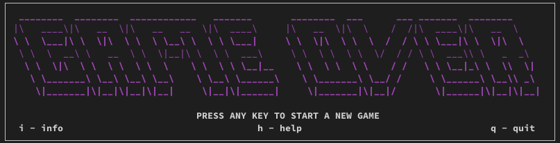

# Snake Game

Simple implementation of the **classic Snake game** using Bash scripting. The game is played in the terminal and provides a nostalgic experience with basic graphics and controls. It is designed to be lightweight and easy to run on any system with a Bash shell.

## Game Rules
The player controls a **snake** moving on the **board**. There are **apples** (red squares) on the board, which, when eaten, **increase the length of the snake**. When one apple is eaten, a new one is randomly generated on the board. The goal of the game is to achieve **the longest possible snake**.

 Collision with the edges of the board or with the snake itself **ends the game**.

 

## Features
- Score counting.
- Start a new game after losing.
- Graphic design.
- Keyboard control.
- Help and version information.